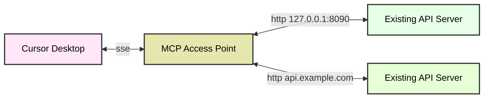

# MCP Access Gateway  

`MCP` Access Gateway is a lightweight protocol conversion gateway tool designed to establish a communication bridge between traditional `HTTP` services and `MCP` (Model Context Protocol) clients. It enables MCP clients to interact directly with existing HTTP services without requiring any server-side interface modifications.  
<p align="center">
  <a href="./README.md"></a>
  <a href="./README_CN.md"></a>
</p>

## Introduction  
This project is built on `Pingora` - an ultra-high performance gateway proxy library capable of supporting massive-scale request proxy services. Pingora has been used to build services that handle core traffic for the Cloudflare platform, consistently serving over 40 million requests per second across the internet for years. It has become the technical cornerstone supporting a significant proportion of traffic on the Cloudflare platform.

## HTTP to MCP  
This mode allows clients like `Cursor Desktop` to communicate with remote HTTP servers through `SSE`, even when the servers themselves don't support the SSE protocol.

- Example setup includes two services:  
  - Service 1 runs locally at `127.0.0.1:8090`  
  - Service 2 runs remotely at `api.example.com`  
- Through the `MCP Access Point`, both services can be converted to MCP services without any code modifications.  
- Clients communicate with `Service 1` and `Service 2` via the MCP protocol. The MCP Access Point automatically distinguishes MCP requests and forwards them to the appropriate backend services.



## Quick Start  

### Installation  
```bash
# Install from source
git clone https://github.com/sxhxliang/mcp-access-point.git
cd mcp-access-point
# Specify OpenAPI.json path, MCP port, and upstream service address
cargo run -- -f openapi_for_demo.json -p 8080 -u localhost:8090
# Use remote OpenAPI spec (e.g., petstore.swagger.io)
cargo run -- -f https://petstore.swagger.io/v2/swagger.json -p 8080 -u localhost:8090
# Use config.yaml (see example below)
cargo run -- -c config.yaml

# Use inspector for debugging (start service first)
npx @modelcontextprotocol/inspector@0.8.1 node build/index.js
# Access http://127.0.0.1:6274/
# Select "see" and enter 0.0.0.0:8080/sse, then click connect
```

### Parameter Details:  
1. **`-f openapi_for_demo.json`**  
   - `-f` (or `--file`) specifies the path to the OpenAPI specification file (`openapi_for_demo.json`).  
   - This file defines the APIs that the MCP Access Point will proxy and convert.  

2. **`-p 8080`**  
   - `-p` (or `--port`) sets the listening port (`8080`) for the MCP Access Point to receive client requests.  

3. **`-u localhost:8090`**  
   - `-u` (or `--upstream`) specifies the upstream service address (`localhost:8090`).  
   - The MCP Access Point forwards processed requests to this backend service.  

4. **`-c config.yaml`**  
   - `-c` (or `--config`) specifies the configuration file path (`config.yaml`).  
   - This file defines multiple MCP services and their configurations.  

#### config.yaml Example  
```yaml
# config.yaml example (supports multiple services)
mcps:
  - service-1:  # Service identifier
      upstream: 127.0.0.1:8090  # Backend service address
      path: local_openapi.json  # Local OpenAPI file path
  - service-2:
      upstream: api.example.com 
      path: https://petstore.swagger.io/v2/swagger.json  # Supports network paths
```

To run the MCP Access Point using the configuration file, use the following command:
```bash
cargo run -- -c config.yaml
```

## Core Features  

- **Protocol Conversion**: Seamless conversion between HTTP and MCP protocols  
- **Zero-Intrusive Integration**: Full compatibility with existing HTTP services  
- **Client Empowerment**: Enables MCP clients to directly call standard HTTP services  
- **Lightweight Proxy**: Minimalist architecture with efficient protocol conversion  

## Running via Docker  

### Build Docker Image (Optional)  
```bash
# Clone repository
git clone https://github.com/sxhxliang/mcp-access-point.git
cd mcp-access-point

# Build image
docker build -t kames2025/mcp-access-point:latest .
```

### Run Docker Container  
```bash
# Using environment variables (upstream service running on host)
# Note: Replace /path/to/your/openapi.json with actual path
# Note: Use host.docker.internal for upstream address (or host's LAN IP if needed)
docker run -d --name mcp-access-point --rm \
  -p 8080:8080 \
  -e port=8080 \
  -e upstream=host.docker.internal:8090 \
  -e openapi_json=/app/config/openapi.json \
  -v /path/to/your/openapi.json:/app/config/openapi.json \
  kames2025/mcp-access-point:latest
```

### Environment Variables  
- `port`: MCP Access Point listening port (default: 8080)
- `upstream`: Upstream service address (default: localhost:8090)
- `openapi_json`: OpenAPI spec file path (default: /app/config/openapi.json)

## Typical Use Cases  

- **Progressive Architecture Migration**: Facilitate gradual transition from HTTP to MCP  
- **Hybrid Architecture Support**: Reuse existing HTTP infrastructure within MCP ecosystem  
- **Protocol Compatibility**: Build hybrid systems supporting both protocols  

**Example Scenario**:  
When MCP-based AI clients need to interface with legacy HTTP microservices, the MCP Access Gateway acts as a middleware layer enabling seamless protocol conversion.