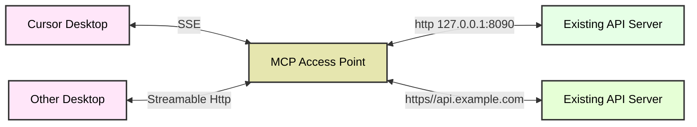

# MCP Access Point  

`MCP Access Point` is a lightweight protocol conversion gateway tool designed to establish a communication bridge between traditional `HTTP` services and `MCP` (Model Context Protocol) clients. It enables MCP clients to interact directly with existing HTTP services without requiring any server-side interface modifications.  
<p align="center">
  <a href="./README.md"></a>
  <a href="./README_CN.md"></a>
  <a href="https://deepwiki.com/sxhxliang/mcp-access-point"></a>
  <a href="https://zread.ai/sxhxliang/mcp-access-point"></a>
</p>

## Introduction  
This project is built on `Pingora` - an ultra-high performance gateway proxy library capable of supporting massive-scale request proxy services. Pingora has been used to build services that handle core traffic for the Cloudflare platform, consistently serving over 40 million requests per second across the internet for years. It has become the technical cornerstone supporting a significant proportion of traffic on the Cloudflare platform.

## HTTP to MCP  
This mode allows clients like `Cursor Desktop` to communicate with remote HTTP servers through `SSE`, even when the servers themselves don't support the SSE protocol.

- Example setup includes two services:  
  - Service 1 runs locally at `127.0.0.1:8090`  
  - Service 2 runs remotely at `api.example.com`  
- Through the `MCP Access Point`, both services can be converted to MCP services without any code modifications.  
- Clients communicate with `Service 1` and `Service 2` via the MCP protocol. The MCP Access Point automatically distinguishes MCP requests and forwards them to the appropriate backend services.



### Transport Type (Specification)
Currently supports `SSE` and `Streamable HTTP` protocols:
- ✅ Streamable HTTP (stateless) 2024-03-26
  - All services: `ip:port/mcp`
  - Single service: `ip:port/api/{service_id}/mcp`
  
- ✅ SSE 2024-11-05
  - All services: `ip:port/sse`
  - Single service: `ip:port/api/{service_id}/sse`

use `IP:PORT/sse` for `SSE` 
use `IP:PORT/mcp` for `Streamable HTTP` 

### Supported MCP clients
- ✅ [MCP Inspector](https://github.com/modelcontextprotocol/inspector)
- ✅ [Cursor Desktop](https://docs.cursor.com/context/model-context-protocol)
- ✅ [Windsurf](https://docs.windsurf.com/plugins/cascade/mcp#model-context-protocol-mcp)
- ✅ [VS Code](https://code.visualstudio.com/docs/copilot/chat/mcp-servers)
- ✅ [Trae](https://docs.trae.ai/ide/model-context-protocol)

## Core Features  
- **Protocol Conversion**: Seamless conversion between HTTP and MCP protocols  
- **Zero-Intrusive Integration**: Full compatibility with existing HTTP services  
- **Client Empowerment**: Enables MCP clients to directly call standard HTTP services  
- **Lightweight Proxy**: Minimalist architecture with efficient protocol conversion  
- **Multi-tenancy**: Independent configuration and endpoints for each tenant

## Quick Start  

### Installation  
```bash
# Install from source
git clone https://github.com/sxhxliang/mcp-access-point.git
cd mcp-access-point
cargo run -- -c config.yaml

# Use inspector for debugging (start service first)
npx @modelcontextprotocol/inspector node build/index.js
# Access http://127.0.0.1:6274/
# Select "SSE" and enter 0.0.0.0:8080/sse, then click connect
# or select "Streamable HTTP" and enter 0.0.0.0:8080/mcp
```

### Multi-tenancy Support
The MCP Access Gateway supports multi-tenancy, where each tenant can configure multiple MCP services accessible via:
- `/api/{mcp-service-id}/sse` (for SSE)
- `/api/{mcp-service-id}/mcp` (for Streamable HTTP)

Example configuration:
```yaml
# config.yaml example (supports multiple services)

mcps:
  - id: service-1 # Access via /api/service-1/sse or /api/service-1/mcp
    ... # Service configuration
  - id: service-2 # Access via /api/service-2/sse or /api/service-2/mcp
    ... # Service configuration
  - id: service-3 # Access via /api/service-3/sse or /api/service-3/mcp
    ... # Service configuration
```

To access all services simultaneously, use:
- `0.0.0.0:8080/mcp` (Streamable HTTP)
- `0.0.0.0:8080/sse` (SSE)

### Configuration Details
1. **`-c config.yaml`**
   - `-c` (or `--config`) specifies the configuration file path (`config.yaml`).
   - This file defines the APIs that the MCP Access Point will proxy and convert.

### config.yaml Example
The configuration file supports multi-tenancy, allowing independent configuration of upstream services and routing rules for each MCP service. Key configuration items include:

1. **mcps** - MCP service list
   - `id`: Unique service identifier used to generate access paths
   - `upstream_id`: Associated upstream service ID
   - `path`: OpenAPI specification file path (local or remote)
   - `routes`: Custom routing configuration (optional)
   - `upstream`: Upstream service specific configuration (optional)

2. **upstreams** - Upstream service configuration
   - `id`: Upstream service ID
   - `nodes`: Backend node addresses and weights
   - `type`: Load balancing algorithm (roundrobin/random/ip_hash)
   - `scheme`: Upstream protocol (http/https)
   - `pass_host`: HTTP Host header handling
   - `upstream_host`: Override Host header value

Complete configuration example:
```yaml
# config.yaml example (supports multiple services)
mcps:
  - id: service-1 # Unique identifier, accessible via /api/service-1/sse or /api/service-1/mcp
    upstream_id: 1
    path: config/openapi_for_demo_patch1.json # Local OpenAPI spec path

  - id: service-2 # Unique identifier
    upstream_id: 2
    path: https://petstore.swagger.io/v2/swagger.json # Remote OpenAPI spec

  - id: service-3 
    upstream_id: 3
    routes: # Custom routing
      - id: 1
        operation_id: get_weather
        uri: /points/{latitude},{longitude}
        method: GET
        meta:
          name: Get Weather
          description: Retrieve weather information by coordinates
          inputSchema: # Optional input validation
            type: object
            required:
              - latitude
              - longitude
            properties:
              latitude:
                type: number
                minimum: -90
                maximum: 90
              longitude:
                type: number
                minimum: -180
                maximum: 180

upstreams: # Required upstream configuration
  - id: 1
    headers: # Headers to send to upstream service
      X-API-Key: "12345-abcdef"        # API key
      Authorization: "Bearer token123" # Bearer token
      User-Agent: "MyApp/1.0"          # User agent
      Accept: "application/json"       # Accept header
    nodes: # Backend nodes (IP or domain)
      "127.0.0.1:8090": 1 # Format: address:weight

  - id: 2 
    nodes:
      "127.0.0.1:8091": 1

  - id: 3 
    nodes:
      "api.weather.gov": 1
    type: roundrobin # Load balancing algorithm
    scheme: https # Protocol
    pass_host: rewrite # Host header handling
    upstream_host: api.weather.gov # Override Host
```

To run the MCP Access Gateway with config file:
```bash
cargo run -- -c config.yaml
```

## Running via Docker  

### Run Locally for quick start

```bash
# Note: Replace /path/to/your/config.yaml with actual path
docker run -d --name mcp-access-point --rm \
  -p 8080:8080 \
  -e port=8080 \
  -v /path/to/your/config.yaml:/app/config/config.yaml \
  ghcr.io/sxhxliang/mcp-access-point:main
```


### Build Docker Image (Optional)  
- install docker
- clone repository and build image
```bash
# Clone repository
git clone https://github.com/sxhxliang/mcp-access-point.git
cd mcp-access-point

# Build image
docker build -t liangshihua/mcp-access-point:latest .
```

- Run Docker Container
```bash
# Using environment variables (service running on host)
# Note: Replace /path/to/your/config.yaml with actual path

docker run -d --name mcp-access-point --rm \
  -p 8080:8080 \
  -e port=8080 \
  -v /path/to/your/config.yaml:/app/config/config.yaml \
  liangshihua/mcp-access-point:latest
```

### Environment Variables  
- `port`: MCP Access Point listening port (default: 8080)

## Typical Use Cases  

- **Progressive Architecture Migration**: Facilitate gradual transition from HTTP to MCP  
- **Hybrid Architecture Support**: Reuse existing HTTP infrastructure within MCP ecosystem  
- **Protocol Compatibility**: Build hybrid systems supporting both protocols  

**Example Scenario**:  
When MCP-based AI clients need to interface with legacy HTTP microservices, the MCP Access Gateway acts as a middleware layer enabling seamless protocol conversion.

Many thanks to [@limcheekin](https://github.com/limcheekin) for writing an article with a practical example: https://limcheekin.medium.com/building-your-first-no-code-mcp-server-the-fabric-integration-story-90da58cdbe1f

## Contribution Guidelines
1. Fork this repository.
2. Create a branch and commit your changes.
3. Create a pull request and wait for it to be merged.
4. Make sure your code follows the Rust coding standards.