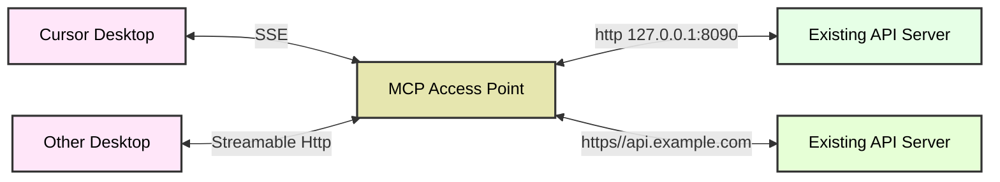

# MCP Access Point

`MCP Access Point`是一款轻量级的协议转换网关工具，专门用于在传统`HTTP`服务与`MCP`（模型上下文协议）客户端之间建立通信桥梁。它使得MCP客户端无需任何服务端接口改造，即可直接与现有HTTP服务进行交互。  
<p align="center">
  <a href="./README.md"></a>
  <a href="./README_CN.md"></a>
  <a href="https://deepwiki.com/sxhxliang/mcp-access-point"></a>
  <a href="https://zread.ai/sxhxliang/mcp-access-point"></a>
</p>

## 简介
本项目基于`Pingora`——一个超高性能的网关代理库，能够支撑超大规模的请求代理服务。Pingora已被用于构建支撑Cloudflare平台核心流量处理的服务体系，多年来持续为互联网提供每秒超过4000万次请求的服务能力，目前已成为Cloudflare平台上处理相当大比例流量的技术基石。

## Http to MCP
此模式允许 `Cursor Desktop` 等客户端通过 `SSE` 与远程`Http`服务器通信，即使它本身不受支持`SSE`协议。

- 示例包含两个服务：  
  - 服务1运行于本地`127.0.0.1:8090`  
  - 服务2运行于远程`api.example.com`  
- 通过 `MCP Access Point`，服务1与服务2可以转成MCP服务，且服务1与服务2的代码都无需任何改造。
- 客户端通过 `MCP` 协议，`服务1`与`服务2`进行通信，`MCP Access Point` 自动区分`MCP`请求，并自动将请求转发到对应的后端服务。


### MCP 协议支持
目前支持 `SSE` 和`Streamable HTTP`协议。
- ✅ Streamable HTTP(stateless) 2024-03-26
  -  所有服务使用 `ip:port/mcp`
  -  单服务使用 `ip:port/api/{service_id}/mcp`
  
- ✅ SSE 2024-11-05
  - 所有服务 `SSE` 使用 `ip:port/sse`
  - 单服务 `SSE` 使用 `ip:port/api/{service_id}sse`

### 支持的客户端
- ✅ [MCP Inspector](https://github.com/modelcontextprotocol/inspector)
- ✅ [Cursor Desktop](https://docs.cursor.com/context/model-context-protocol)
- ✅ [Windsurf](https://docs.windsurf.com/plugins/cascade/mcp#model-context-protocol-mcp)
- ✅ [VS Code](https://code.visualstudio.com/docs/copilot/chat/mcp-servers)
- ✅ [Trae](https://docs.trae.ai/ide/model-context-protocol)

## 核心特性  

- **协议转换**：实现HTTP与MCP协议的无缝转换  
- **零侵入式接入**：完全兼容现有HTTP服务，无需任何改造  
- **客户端赋能**：让MCP生态客户端能够直接调用标准HTTP服务  
- **轻量级代理**：极简架构设计，协议转换高效透明  
- **多租户模式**：支持多租户，每个租户可独立配置MCP服务，独立 url 接入


## 快速开始  

### 安装方式  
```bash
# 从源码安装
git clone https://github.com/sxhxliang/mcp-access-point.git
cd mcp-access-point
# 使用 config.yaml 文件，参考config.yaml示例
cargo run -- -c config.yaml

# 使用inspector调试，先启动服务
npx @modelcontextprotocol/inspector node build/index.js
# 访问 http://127.0.0.1:6274/
# 选择 see 填入0.0.0.0:8080/sse, 点击connect就可以连接上服务啦
# 或者选择 "Streamable HTTP" 填入 0.0.0.0:8080/mcp/, 点击connect连接上服务
```

### 多租户支持
MCP接入网关支持多租户，每个租户可以配置多个MCP服务，
通过/api/{mcp-service-id}/sse （SSE）或者/api/{mcp-service-id}/mcp（Streamable HTTP）访问服务
看下面例子，比如可以通过/api/service-1/mcp访问服务2，通过/api/service-2/mcp访问服务3。
```yaml
# config.yaml 示例 (支持多服务配置)

mcps:
  - id: service-1 # /api/service-1/sse 或者 /api/service-1/mcp
    ... # 服务配置
  - id: service-2 # /api/service-2/sse 或者 /api/service-2/mcp
    ... # 服务配置
  - id: service-3 # /api/service-3/sse 或者 /api/service-3/mcp
    ... # 服务配置
```
同时获取 3 个服务的 MCP 接口
使用0.0.0.0:8080/mcp 或者0.0.0.0:8080/sse 即可访问所有服务。
具体参数请查看 config.yaml

### 参数详解：  
1. **`-c config.yaml`**
   - `-c`（或 `--config`）指定配置文件路径（`config.yaml`）。  
   - 该文件定义了 MCP 接入点要代理转换的 API。

### 使用config.yaml示例
配置文件支持多租户模式，每个MCP服务可以独立配置上游服务和路由规则。主要配置项包括：

1. **mcps** - MCP服务列表
   - `id`: 服务唯一标识，用于生成访问路径(/api/{id}/sse 或 /api/{id}/mcp)
   - `upstream_id`: 关联的上游服务ID
   - `path`: OpenAPI规范文件路径(本地或远程)
   - `routes`: 自定义路由配置(可选)
   - `upstream`: 上游服务特定配置(可选)

2. **upstreams** - 上游服务配置
   - `id`: 上游服务ID
   - `nodes`: 后端节点地址及权重
   - `type`: 负载均衡算法(roundrobin/random/ip_hash)
   - `scheme`: 上游http 服务协议类型(http/https)
   - `pass_host`: http host 处理方式
   - `upstream_host`: 覆盖的http host值

完整配置示例：

```yaml
# config.yaml 示例 (支持多服务配置)

mcps:
  - id: service-1 # 唯一标识，可通过 /api/service-1/sse 或 /api/service-1/mcp 独立访问
    upstream_id: 1
    path: config/openapi_for_demo_patch1.json # 本地OpenAPI规范文件路径

  - id: service-2 # 唯一标识
    upstream_id: 2
    path: https://petstore.swagger.io/v2/swagger.json  # 支持远程OpenAPI规范

  - id: service-3 
    upstream_id: 3
    routes: # 自定义路由配置
      - id: 1
        operation_id: get_weather # 操作标识符
        uri: /points/{latitude},{longitude} # 路径匹配规则
        method: GET
        meta:
          name: 获取天气
          description: 根据经纬度获取天气信息
          inputSchema: # 输入参数校验（可选）
            type: object
            required: # 必填字段
              - latitude
              - longitude
            properties: # 字段定义
              latitude:
                type: number
                minimum: -90   # 纬度最小值
                maximum: 90    # 纬度最大值
              longitude:
                type: number
                minimum: -180  # 经度最小值
                maximum: 180   # 经度最大值

upstreams: # 上游服务配置（必填）
  - id: 1
    headers: # 自定义请求头
      X-API-Key: "12345-abcdef"
      Authorization: "Bearer token123"
      User-Agent: "MyApp/1.0"
      Accept: "application/json"
    nodes: # 后端节点（支持IP或域名）
      "127.0.0.1:8090": 1 # 格式：地址:权重

  - id: 2 
    nodes:
      "127.0.0.1:8091": 1

  - id: 3 
    nodes:
      "api.weather.gov": 1
    type: roundrobin    # 负载均衡算法（支持轮询/随机/IP哈希）
    scheme: https       # 协议类型（支持http/https）
    pass_host: rewrite  # Host头处理方式（设置为rewrite时使用upstream_host覆盖）
    upstream_host: api.weather.gov # 覆盖的Host头值
```

要使用配置文件运行 MCP 接入网关，请按运行以下命令:
```bash
cargo run -- -c config.yaml
```

## 使用Docker运行

### 使用已经构建好的docker镜像

```bash
# 注意：将 /path/to/your/config.yaml 替换为你本地文件的实际路径
docker run -d --name mcp-access-point --rm \
  -p 8080:8080 \
  -e port=8080 \
  -v /path/to/your/config.yaml:/app/config/config.yaml \
  ghcr.io/sxhxliang/mcp-access-point:main
```

### 构建Docker镜像（可选，如果你想本地构建）
- 确保已安装Docker
- 运行以下命令
```bash
# 克隆仓库
git clone https://github.com/sxhxliang/mcp-access-point.git
cd mcp-access-point

# 构建Docker镜像
docker build -t sxhxliang/mcp-access-point:latest .
```

- 运行Docker容器
```bash
# 使用环境变量配置
# 注意：将 /path/to/your/config.yaml 替换为你本地文件的实际路径
docker run -d --name mcp-access-point --rm \
  -p 8080:8080 \
  -e port=8080 \
  -v /path/to/your/config.yaml:/app/config/config.yaml \
  sxhxliang/mcp-access-point:latest
```

### 环境变量说明
- `port`: MCP接入网关监听端口，默认为8080

## 典型应用场景  

- **渐进式架构迁移**：帮助HTTP服务逐步过渡到MCP架构体系  
- **混合架构支持**：在MCP生态中复用现有HTTP基础设施  
- **协议兼容方案**：构建同时支持双协议体系的混合系统  

**典型案例**：  
当采用MCP协议的AI客户端需要对接企业遗留的HTTP微服务时，MCP接入网关可作为中间层，实现协议的无缝转换。


非常感谢 [@limcheekin](https://github.com/limcheekin)
写了一篇文章介绍了一个实际例子，https://limcheekin.medium.com/building-your-first-no-code-mcp-server-the-fabric-integration-story-90da58cdbe1f

## 贡献指南
1. Fork 这个仓库。
2. 创建一个分支，并提交你的修改。
3. 创建一个 Pull Request，并等待合并。
4. 确保你的代码遵循 Rust 的编码规范。


