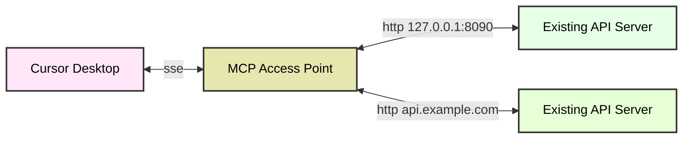

# MCP接入网关  

`MCP`接入网关是一款轻量级的协议转换网关工具，专门用于在传统`HTTP`服务与`MCP`（模型上下文协议）客户端之间建立通信桥梁。它使得MCP客户端无需任何服务端接口改造，即可直接与现有HTTP服务进行交互。  
<p align="center">
  <a href="./README.md"></a>
  <a href="./README_CN.md"></a>

</p>

## 简介
本项目基于`Pingora`——一个超高性能的网关代理库，能够支撑超大规模的请求代理服务。Pingora已被用于构建支撑Cloudflare平台核心流量处理的服务体系，多年来持续为互联网提供每秒超过4000万次请求的服务能力，目前已成为Cloudflare平台上处理相当大比例流量的技术基石。

## Http to MCP
此模式允许 `Cursor Desktop` 等客户端通过 `SSE` 与远程`Http`服务器通信，即使它本身不受支持`SSE`协议。

- 示例包含两个服务：  
  - 服务1运行于本地`127.0.0.1:8090`  
  - 服务2运行于远程`api.example.com`  
- 通过 `MCP Access Point`，服务1与服务2可以转成MCP服务，且服务1与服务2的代码都无需任何改造。
- 客户端通过 `MCP` 协议，`服务1`与`服务2`进行通信，`MCP Access Point` 自动区分`MCP`请求，并自动将请求转发到对应的后端服务。


### MCP 协议支持
目前支持 `SSE` 和`Streamable HTTP`协议。
- ✅ Streamable HTTP(stateless)
- ✅ SSE 2024-11-05

对于 `SSE` 使用 `IP:PORT/sse`
对于`Streamable HTTP`使用 `IP:PORT/mcp/`


## 快速开始  

### 安装方式  
```bash
# 从源码安装
git clone https://github.com/sxhxliang/mcp-access-point.git
cd mcp-access-point
# 使用 config.yaml 文件，参考config.yaml示例
cargo run -- -c config.yaml

# 使用inspector调试，先启动服务
npx @modelcontextprotocol/inspector node build/index.js
# 访问 http://127.0.0.1:6274/
# 选择 see 填入0.0.0.0:8080/sse, 点击connect就可以连接上服务啦
# 或者选择 "Streamable HTTP" 填入 0.0.0.0:8080/mcp/, 点击connect连接上服务
```
 

### 参数详解：  
1. **`-c config.yaml`**
   - `-c`（或 `--config`）指定配置文件路径（`config.yaml`）。  
   - 该文件定义了 MCP 接入点要代理转换的 API。

#### 使用config.yaml示例
如果使用`config.yaml`，可以配置多个MCP服务，每个MCP服务对应一个`upstream`和`path`。
path 为`openapi.json`的路径，可以使用相对路径或者绝对路径，也可以是网络路径，如：`https://petstore.swagger.io/v2/swagger.json`

```yaml
# config.yaml 示例 (支持多服务配置)

mcps:
  - service-1:  # 服务标识符
    upstream_id: 1
    upstream_config: # 上游服务配置（可选）
      headers:
        X-API-Key: "12345-abcdef"
        Authorization: "Bearer token123"
        User-Agent: "MyApp/1.0"
        Accept: "application/json"
      nodes:
        "127.0.0.1:8090": 1 # 必须与upstreams中的上游ID一致
    path: openapi_for_demo_patch1.json # 本地OpenAPI文件路径

  - web-api-2:
    upstream_id: 2
    path: https://petstore.swagger.io/v2/swagger.json  # 支持网络路径

upstreams: # 必须定义上游服务配置
  - id: 1
    nodes: #（例如：web服务器或API服务器）
      "127.0.0.1:8090": 1 # 地址及权重

  - id: 2 # 另一个上游服务 
    nodes:
      "127.0.0.1:8091": 1
```

要使用配置文件运行 MCP 接入网关，请按运行以下命令:
```bash
cargo run -- -c config.yaml
```

## 核心特性  

- **协议转换**：实现HTTP与MCP协议的无缝转换  
- **零侵入式接入**：完全兼容现有HTTP服务，无需任何改造  
- **客户端赋能**：让MCP生态客户端能够直接调用标准HTTP服务  
- **轻量级代理**：极简架构设计，协议转换高效透明  

## 使用Docker运行

### 构建Docker镜像（可选，如果你想本地构建）
```bash
# 克隆仓库
git clone https://github.com/sxhxliang/mcp-access-point.git
cd mcp-access-point

# 构建Docker镜像
docker build -t sxhxliang/mcp-access-point:latest .
```

### 拉取并运行Docker容器(旧版本)
```bash
# 使用环境变量配置（上游服务在宿主机上运行）
# 注意：将 /path/to/your/config.yaml 替换为你本地文件的实际路径
docker run -d --name mcp-access-point --rm \
  -p 8080:8080 \
  -e port=8080 \
  -v /path/to/your/config.yaml:/app/config/config.yaml \
  sxhxliang/mcp-access-point:latest
```

### 环境变量说明
- `port`: MCP接入网关监听端口，默认为8080

## 典型应用场景  

- **渐进式架构迁移**：帮助HTTP服务逐步过渡到MCP架构体系  
- **混合架构支持**：在MCP生态中复用现有HTTP基础设施  
- **协议兼容方案**：构建同时支持双协议体系的混合系统  

**典型案例**：  
当采用MCP协议的AI客户端需要对接企业遗留的HTTP微服务时，MCP接入网关可作为中间层，实现协议的无缝转换。


